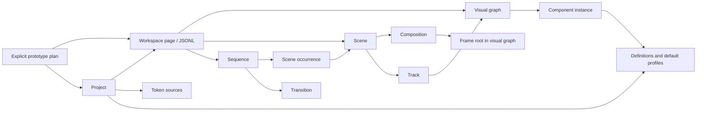

# Relationships and candidate semantics

This document proposes meaning for the [paper model](README.md). The [coverage ledger](design-coverage.md) names unresolved decisions. Only the stated candidate subset is represented by schemas; broader product requirements stay visible rather than being silently removed. Draft 0.3.0 adds [visual authoring](visual-authoring.md), including optional owned definition bodies, source placements and project changes. The retained 0.2.0 motion subset follows the confirmed rules in [composition authoring](authoring.md), which supersede the earlier shared-root/normalized-key proposal.

## Entities and cardinality

| Entity | Relationship | Ownership rule |
|---|---|---|
| Project | Discovers workspace pages and dependency sources | Repo-relative paths and selected dependency revisions live in the manifest |
| Workspace page | Owns one authored document graph and its JSONL | This is a scratch editing space, not automatically an application route |
| Visual node | Has one identity and one structural owner; children are ordered edges | Roots and child edges are the authored structure; parent pointers are derived |
| Frame | A bounded visual node with sizing and clipping | A frame is not inherently a scene, route, component, or emitted code element; extraction produces a referenced definition placement |
| Component instance | References a library, definition identity, and version; supplies parameter bindings and eligible local properties | Definition source remains outside the instance; an instance edit cannot rewrite it |
| Composition | Owns a frame root and local consumer graph | Shared definitions do not share instance edits |
| Scene | References a composition and a local duration | Animation is scene-local; base edits belong to the composition |
| Track | Belongs to one scene and targets one node/property address | Targets belong to that scene's composition; inactive members retain keys without rendering |
| Sequence | Contains ordered, individually identified scene occurrences and transitions | Order and explicit placement determine playback; storyboard coordinates do not |
| Scene occurrence | References one scene and selects a source interval and sequence start | Repeating a scene produces a new occurrence identity, not a new scene or node identity |
| Transition | Connects two occurrences | The initial schema only admits a cut; overlap and cross-scene correspondence remain undesigned |
| Annotation | Attaches prose to an explicitly typed page/node/scene/sequence target | Narrative notes do not carry hidden motion instructions |

Stable identities survive rename and reparent. Duplicate creates fresh identities; duplicate-with-motion explicitly remaps copied references. Deletion must not leave an exportable dangling target. Cascade/delete repair policy, cross-page references, and library migration are not settled. The candidate schemas express identity shapes but cannot enforce these graph rules.

The application-page concept is distinct from the workspace page. A route/document target may eventually be attached through an adapter-owned mapping; neither a frame label nor a workspace page name is evidence of such a mapping.

## Values, defaults and edit destinations

An authored binding is either a typed literal or a token reference with an expected value type and source identity. It is never a number with an implicit unit. The initial literal types are number, string, boolean, dimension, duration and cubic Bézier easing. Parameter types are checked against the definition; property types against their declared consumers. Schema validation alone does not establish that compatibility.

Candidate base-property resolution, from lowest to highest precedence:

1. The node's selected, versioned kind default profile.
2. A component definition's eligible default, when the node is an instance.
3. Explicit node property override.
Scene-local animation is applied after this composition-owned base resolution; scene static override bags are not carried in 0.2.0. Part and parameter resolution are specified separately in [authoring](authoring.md).

Each selected value can retain a token reference. Resolve it in the project's selected source revisions and named context; do not flatten it back into authored state. Component parameters resolve definition default → instance binding separately from visual properties. Parameter-to-property relationships require a declared adapter mapping rather than inventing a universal CSS cascade.

Then apply admitted motion to the resolved base. Playback and scrubbing return evaluated values and provenance without mutating any preceding layer. This is an abstract ownership chain, not a claim that existing FSDS CSS already realizes a portable document evaluator.

Absence means inherit. Literal `0`, `false`, and an empty string are present values. `null` is not a reset spelling in this candidate. Removing an override restores the chain; an invalid present binding reports an error instead of falling through. Empty paint lists and disabling a paint will need explicit future representations; they cannot be inferred from absence.

Inspector edits name their destination: instance parameter, node/part property, supplied slot, keyframe, definition, token, or composition edge. A measured width or an evaluated translation is observational and read-only until an explicit operation chooses an authored destination. No `computed`, screen bounds, DOM objects, or source framework types are stored in the initial node schema.

## Geometry and composition boundaries

The current schema admits frames, groups, rectangle shapes, text, component instances and definition placements with ordered children and optional slot identities. It describes freeform versus flow layout but does not yet define a full layout solver. Semantic property addresses are qualified names such as `sizing.width` and `transform.translation.x`; schema syntax does not authorize arbitrary addresses or prove consumer reachability.

Transforms are presentation offsets relative to resting layout. They do not rewrite layout constraints. Translation tracks in the first example explicitly use parent coordinates. Units supported by the candidate dimension carrier are `px` and `rem`; conversion requires a declared environment, and portable layout meaning remains partial. Solid fills, linked corners and a bounded horizontal layout now have a paper representation; richer vectors, masks, paints, typography runs, procedural effects, media and accessibility semantics need further design.

Reparenting must select preserve-world or preserve-local placement. An unrepresentable coordinate conversion refuses before mutation. Reuse of a definition does not establish animation continuity across different instances. A scene identifies a composition; local insertion edits that composition, while timed appearance uses a scene-local visibility track. Deliberate composition sharing shares base edits, not scene evaluation state. Simultaneous evaluation isolation, overlap and the storyboard representative sample time remain open. See [authoring ownership](authoring.md).

## Time and motion

The manifest selects positive integer ticks per second. Stored scene/sequence coordinates are nonnegative integer ticks. A duration literal carries `ms` or `s`; a duration token keeps that binding. Conversion into ticks must be exact in the first candidate, otherwise reject as unsupported; frame-rate sampling and rounding policy remain open.

A scene has an active local interval `[0, durationTicks)`. Focused inspection may evaluate its end boundary; sequence playback selects the next occurrence at a cut rather than drawing both. An occurrence samples `[sourceInTicks, sourceOutTicks)` at sequence time `atTicks`, at rate 1 in this candidate. Thus local scene time is `sourceInTicks + sequenceTime - atTicks`. Occurrences must fit scene duration, and transitions must name actual neighboring occurrences. Overlap requires a future transition design; array order is not permission to blend.

Draft 0.2.0 stores stable keys at scene-local ticks or duration bindings. The composition supplies an implicit start unless an explicit key exists at tick 0. Incoming key easing controls each continuous segment; discrete visibility steps at its key. The final key holds through scene end. Without tracks the scene is static. Changing a duration token moves its addressed key and requires order/bounds revalidation, without resizing the scene. See [authoring semantics](authoring.md).

The bounded candidate properties are translation X/Y, opacity and visibility. Translation requires dimensional bindings, opacity numeric bindings and visibility boolean bindings. Multiple replacement writers to the same scene/node/part/property refuse. Graph integrity, compatibility, resolved key order, easing and conflict detection are not enforced by schema shape.

Slide-in/slide-out/custom are authoring recipes, not primitive track types. A future preset instance must retain its recipe identity/version, parameters, target and coordinate policy, with generated tracks remaining distinguishable from manual edits. Recipe editing/expansion is not yet designed. Input triggers, interruption, loops, spring motion, media time and export fidelity also remain open.

## JSONL and history

A page begins with a versioned header at revision 0. Each later line is one complete accepted transaction with a transaction identity, actor identity, expected revision, resulting revision and operations. 0.3.0 permits the first transaction to initialize an original document or create a composition from the header-established empty page; the earlier initialization convention is superseded explicitly. The composition vocabulary addresses compositions, instance bindings/slots, and scene property tracks/keys, with explicit undo/redo links. [Authoring](authoring.md) names each effect and its required inverse data. Further mutation vocabulary requires corresponding ownership and inverse design.

Acceptance requires `expectedRevision = currentRevision` and `revision = currentRevision + 1`, uniqueness of transaction identities, and atomic validation of all operations. A stale or invalid operation changes nothing. Rejected requests are not successful page transactions; their audit disposition needs separate design. Revision numbers are local ordering, not globally unique Git revisions.

Undo/redo appends new accepted transactions referencing the operation being reversed; it does not erase history. Drag previews can be transient overlays, followed by one accepted meaningful edit. Bounded extraction restoration, composition-creation removal and structured-field reset now have paper forms in [visual authoring](visual-authoring.md). The broader inverse vocabulary, branching, cross-page undo, compaction, durable append/fsync, torn-write recovery and external-change reconciliation are not implemented or fully designed. A newline does not prove durable persistence. Checkpoints are derived and must identify their source revision and integrity binding.

## Tokens and dependencies

Both modes select the same repo-relative token sources and resolver context. A token reference contains source identity and token path; the manifest carries the selected revision. Watching files should invalidate dependent evaluations, with unsaved edits, invalid source, saved revision and rendered revision reported separately. A Git project is the sharing boundary, not a synchronization process.

The example token source provides duration, easing and distance. Keys may bind duration-based time, easing and typed property values. The original Button examples retain translation and opacity token references; independent tables distinguish these from literal overrides. This is deliberately smaller than the requested DTCG exchange coverage. Alias cycles, pointer references, composites, extensions, collision handling, source-preserving edits and Resolver context precedence remain qualification obligations. The current CSS-oriented resolved token output is not an editable interchange authority.

Relative paths identify dependencies, but safe path resolution must also account for symlinks and filesystem boundaries. The schema rejects obvious traversal and absolute paths; it is not a filesystem sandbox. Opaque example revisions are not content hashes, signatures or attestation. Pinning, relocation, missing-dependency recovery and multi-file transaction custody remain open.

## Preview and prototype materialization

Preview may render an existing component via a declared adapter without creating source. A prototype plan selects the document revision, project revision, dependency revisions, roots or sequence, adapter identity, target, required capabilities and proposed output root. `fail-on-unsupported` is the only candidate capability policy. Write conflict policy is explicit; target source maps and admission checks must be designed before execution.

One node may lower to many runtime elements, and several nodes may lower to one. Mapping is maintained by the adapter, not inferred from names. Generated components persist through their upstream contracts; external definitions are read-only unless a supported source-edit mapping is declared. Editor-created servers and attached servers have distinct ownership. Save success and preview freshness remain separate states.

No prototype execution, source editing, server management, target admission or output guarantee is implemented by these schemas. The example's `example.web-dom` adapter identity is fictional and carries no current capability claim.

## Independently specified worked expectations

The original two-composition Button walkthrough and its [expected-state tables](worked-expectations.md) specify future evaluator, inheritance and history observations. They are not observed runtime results. The verifier qualifies schemas, exact example addresses and paper-table custody only; it does not compute those states.

Source round-trip tests must recover authored values and references, not just equivalent pixels. Future runtime probes independently check sampled geometry, inheritance, source persistence, preview/export agreement and negative controls.
